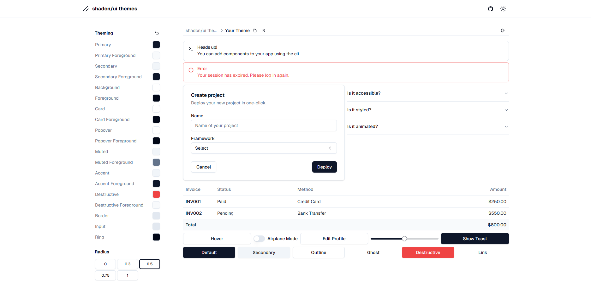

## shadcn/ui themes

Customize your [shadcn/ui](https://github.com/shadcn-ui/ui) theme that you can copy and paste into your apps. Free and Open Source. Use this to extract maximum power of shadcn/ui.

## Development stages

- [x] Changing colors
- [x] Render the appropriate color in the color picker
- [x] Add input to color picker
- [x] Add more shadcn/ui example components
- [x] Restore to the default theme
- [x] Export the theme
- [ ] Saving the theme to local storage

## Contributing

Feel free to contribute, I will add a contribution guide later.

## License

Licensed under the [MIT license](https://github.com/Tellay/shadcn-ui-themes/blob/main/LICENSE).
